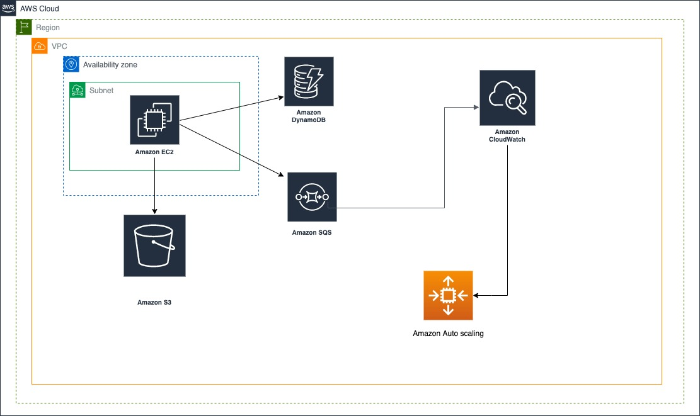

# Autoscaling the WordFreq Application

This project uses Amazon Web Services (AWS) to set up autoscaling for the WordFreq application so that many files could be uploaded to the AWS S3 bucket faster. The details of this application and the architecture are outlined as below:

# The WordFreq Application

The WordFreq application is used for counting the top ten words in the text file. This service has four parts, namely Amazon EC2, Amazon DynamoDB, Amazon S3, SQS Queues. After uploading files to S3 bucket, the massage for uploading files and location of files will send to the first SQS Queues known as “jobs”. The message in flight of this queues will appear which means being processed by the application and 1 massage represents the 1 file. The message available will appear which mean the process is finished. And then, EC2 will check the result of the message in SQS Queues to find the specific location file. Next, it will get the file from the S3 bucket for processing. Finally, it writes the result to the DynamoDB Table and the second Queues called “results”. The second massage Queues will appear the number on message in flight and message available which means the process of counting words. In DynamoDB Table will show the map of the common top 10 words in each file.

