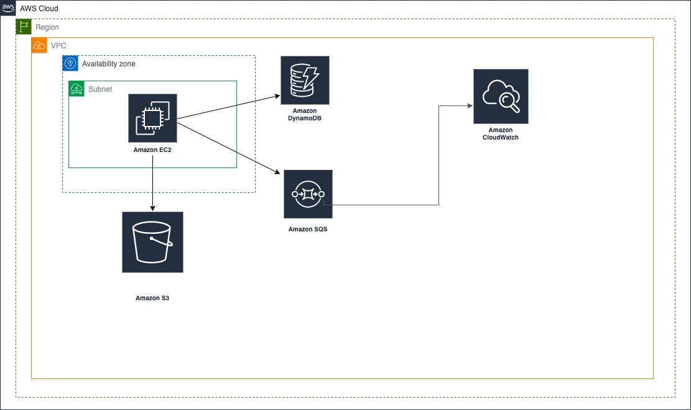
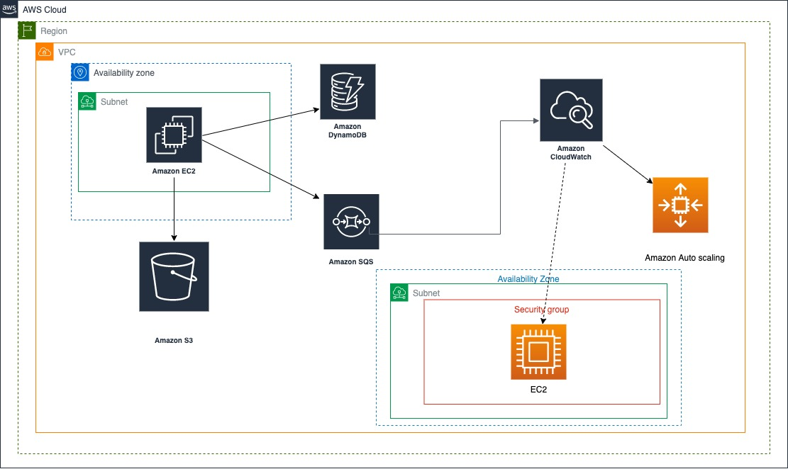
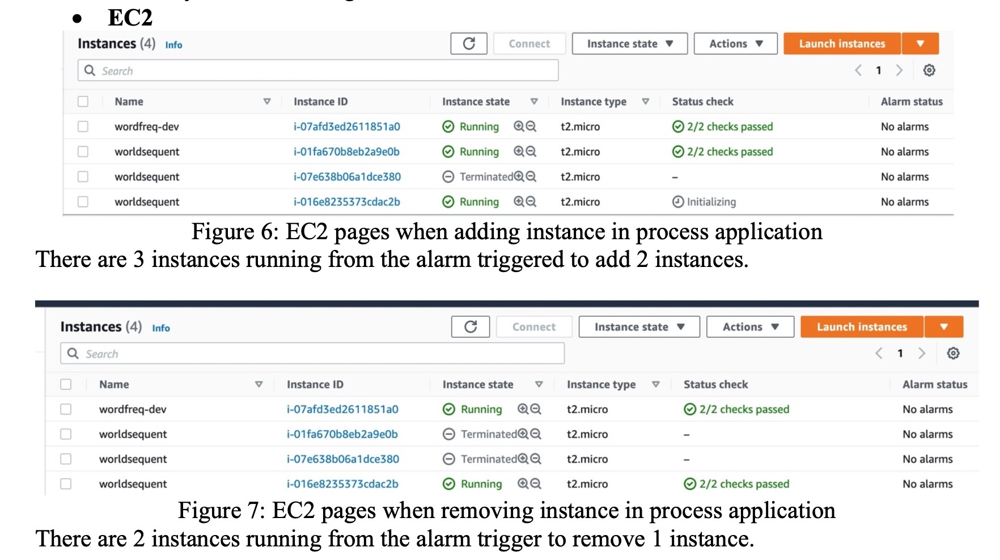

# Autoscaling the WordFreq Application

This project uses Amazon Web Services (AWS) to set up autoscaling for the WordFreq application so that many files could be uploaded to the AWS S3 bucket faster. The details of this application and the architecture are outlined as below:

# The WordFreq Application

The WordFreq application is used for counting the top ten words in the text file. This service has four parts, namely Amazon EC2, Amazon DynamoDB, Amazon S3, SQS Queues. After uploading files to S3 bucket, the massage for uploading files and location of files will send to the first SQS Queues known as “jobs”. The message in flight of this queues will appear which means being processed by the application and 1 massage represents the 1 file. The message available will appear which mean the process is finished. And then, EC2 will check the result of the message in SQS Queues to find the specific location file. Next, it will get the file from the S3 bucket for processing. Finally, it writes the result to the DynamoDB Table and the second Queues called “results”. The second massage Queues will appear the number on message in flight and message available which means the process of counting words. In DynamoDB Table will show the map of the common top 10 words in each file.

***When process of this application without Auto Scaling Group. This process takes 13.29 minutes for processing file.*** It can see from the SQS when the massage infight shows 1 until the number shows in massage available only.

# Design and implement Auto-scaling

In this task, this application needs to add the Amazon Auto Scaling to the application to adjust capacity when process upload flies for launching/terminating a new instance and Amazon CloudWatch to set up alarms to monitor the metrics so, the instance can be removed or added depending on the policy.

**The setting up instruction follows below:**  

**1. Create a launch configuration**
* Name: coursework-configuration
* AMI: wordfreq-dev-img
* Instance type: t2.micro
* IAM instance profile: EMR_EC2_DefaultRole
* Monitoring: Select Enable EC2 instance detailed monitoring within CloudWatch 
* Security Group: choose a new security group and SSH (port22)
* Key pair: choose the learnerlab-keypair.pem  

**2. Create the Auto Scaling Groups**
* Name: labcoursework-autoscaling
* Lunch Configuration: coursework-configuration
* Network: Default VPC
* Availability Zone: choose 4 Availability Zone
* Load Balancing: No (Because it doesn’t create the web server)
* Health Checks: 300 second (health check for EC2 instance)
* Monitoring: Select Enable group metric collection within CloudWatch (The metric will monitor in a CloudWatch)
* Group size: Desired capacity: 1 (There are minimum one instance to process application), Minimum capacity: 1 (There are minimum one instance to process application), Maximum capacity: 2
* Scaling policy: None Tag, Key: Name, Value: worldsequent  

**3. Set up the CloudWatch**  
    
**3.1 Create the first alarms for adding capacity Metric:**
* Choose the SQS (It has the SQS in the application so, it is suitable for choosing matric from the SQS and attached it with SQS)
* Select QueueName: wordfreq-job
* Matric Name: NumberOfMessagesReceived
* Matric name: NumberOfEmptyReceives
* Statistic: Sum
* Period: 1 minutes (The alarm will trigger within 1 minute, if the metric value is above the threshold value)
* Condition: Threshold type: Static, Greater 20 (If the metric exceeds than 20, the alarm will trigger)
* Alarm Name: labcoursework-addcapacity

**3.2 Create the second alarms for removing capacity**
* Metric: Choose the SQS
* Select QueueName: wordfreq-job
* Matric Name: NumberOfMessagesReceived
* Matric name: NumberOfEmptyReceives Statistic: Sum
* Period: 1 minutes
* Condition: Threshold type: Static, Lower/Equal 10 (If the metric value is below than 10, the alarm will trigger)
* Alarm Name: labcoursework-removecapacity  

**4. Create simple scaling policies.**  

Go back to the Auto Scaling Group page and then choose the labcoursework-autoscaling After that click Automatic scaling and then create Dynamic scaling policies  

**4.1 Create policy for adding capacity**
* Policy type: Simple scaling
* Scaling policy name: labcoursework-policy-addcapacity
* CloudWatch alarm: labcoursework-addcapacity (When matric is greater 30 for 1 min and it will breach the alarm threshold to add 1 capacity)
* Action: Add 1 capacity unit     
* And then wait: 300 (cool down period)  
     
**4.2 Create policy for removing capacity**    
* Policy type: Simple scaling     
* Scaling policy name: labcoursework-policy-removecapacity
* CloudWatch alarm: labcoursework-addcapacity (When matric is less than 10 for 5 min and it will breaches the alarm threshold to remove 1 capacity)
* Action: Remove 1 capacity unit
* And then wait: 300 (cool down period)

This application start process at 13.11.02 pm. It took 28.17 minutes before launching a new EC2 when the added capacity was triggered because this metric exceeds than 20 and used 33 sec for the process instance. However, this application uses 43 sec for removing capacity to 1 instance and took around 28.8 min before terminating after finished process so, this process for auto-scaling was too long and not good for implementation. It should process auto-scaling when uploading file so, I will modify the auto-scaling in the next session.
